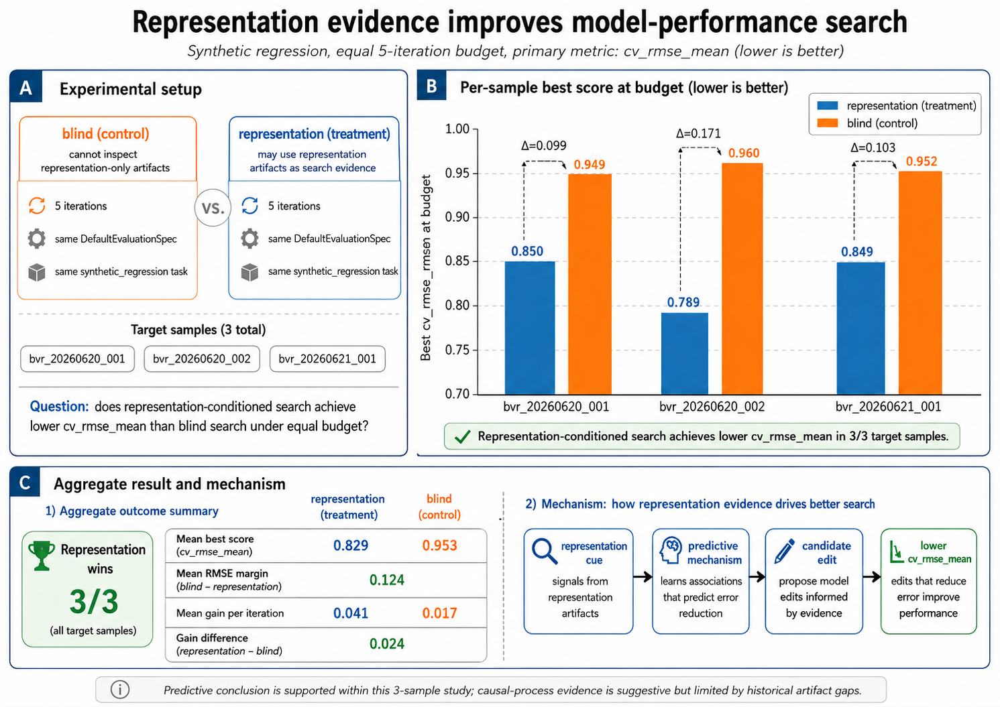
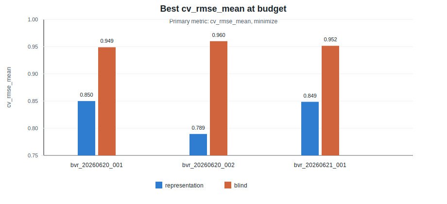
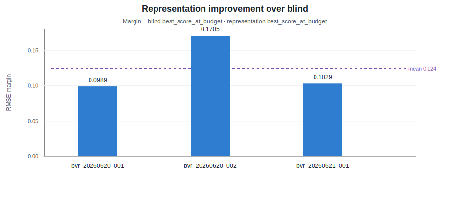
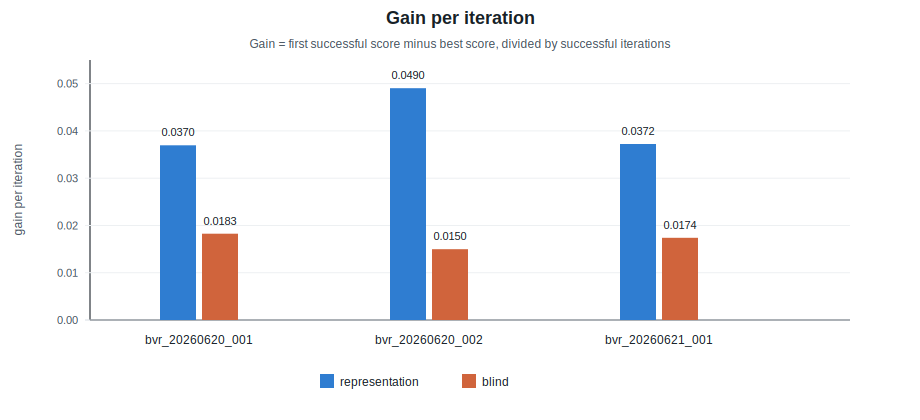

# Representation Evidence and Model-Performance Search in a Synthetic Regression LoopRun Experiment

## Abstract

This report evaluates whether representation artifacts improve agentic model-search performance in the `synthetic_regression` project. The experiment compares two five-iteration conditions: a `blind` control condition, where design sessions cannot inspect representation-only artifacts, and a `representation` treatment condition, where representation evidence can guide candidate search. The primary metric is `cv_rmse_mean`, minimized under the fixed `DefaultEvaluationSpec`. Across three target samples, representation wins 3/3. Mean best score at budget is `0.8293449407491994` for representation and `0.9534807481699941` for blind, yielding a mean RMSE margin of `0.12413580742079466`. These results support the predictive conclusion that representation evidence improved model-performance search in this sample. Causal-process claims remain limited because older runs did not uniformly preserve pre-design causal rationale, and one sample relies on historical journals and leaderboard rows rather than surviving official LoopRun controller artifacts.

## 1. Introduction

AGENTIC-IMODELS treats model interpretability as an agent-facing search signal: a model representation is valuable when another agent can use it to reason about prediction logic, feature effects, sensitivity, counterfactual behavior, and learned structure. The practical question in this experiment is narrower than general interpretability. It asks whether access to representation artifacts helps a coding agent find lower-RMSE candidate models under a fixed search budget.

The research question is:

> Under an equal five-iteration budget, does representation-conditioned model search achieve better `cv_rmse_mean` than blind model search on the `synthetic_regression` project?

The target sample consists of:

- `bvr_20260620_001`
- `bvr_20260620_002`
- `bvr_20260621_001`

This report is limited to setup, management, audit, and reporting scope. It does not design or run new candidates, and it does not inspect raw competition data, hidden targets, generator/oracle internals, or condition-disallowed artifacts.

## 2. Theoretical Background and Literature Review

The relevant theoretical frame is the AGENTIC-IMODELS loop. In this framing, the goal is not only to produce a human-simple model. The goal is to improve the performance-agentic-interpretability frontier by iterating over sklearn-compatible candidate regressors that both predict well and expose a useful textual model representation.

This repository maps that idea into a toy harness:

- The fixed evaluation harness owns scoring, splitting, aggregation, leaderboard policy, and interpretability-judgment plumbing.
- The agent-editable surface is restricted to candidate model code during design sessions.
- Candidate models expose `fit`, `predict`, and `__str__`.
- Predictive quality is measured by the project `EvaluationSpec`; here, the primary metric is `cv_rmse_mean`.
- Representation artifacts are allowed only in representation-conditioned sessions, and blind sessions must not inspect them.

The present experiment uses this framing to test a focused mechanism: representation evidence should improve model-performance search only if it helps translate an observed representation cue into a predictive mechanism and then into a candidate edit that lowers `cv_rmse_mean`. Therefore, the predictive result and the causal-process evidence are evaluated separately.

## 3. Methods

### 3.1 Project and Evaluation Policy

The experiment uses the `synthetic_regression` project with `DefaultEvaluationSpec`:

- Spec name: `default`
- CV strategy: `kfold_5_shuffle_seed42`
- CV design: 5-fold shuffled KFold with random seed 42
- Primary metric: `cv_rmse_mean`
- Direction: minimize
- Budget: 5 iterations per condition

### 3.2 Experimental Conditions

The two experimental conditions are:

- `blind`: control condition. Design sessions cannot inspect model strings, interpretability packets, candidate snapshots, or other representation-only artifacts.
- `representation`: treatment condition. Design sessions may use condition-allowed representation artifacts as search evidence.

The intended representation-condition causal chain is:

```text
representation cue -> predictive mechanism -> candidate edit -> cv_rmse_mean movement
```

### 3.3 Role and Session Isolation

The workflow separates setup/management, condition-specific design, execution, analysis, and audit roles. Condition-specific design sessions start only after `prepare` creates an iteration-specific `input_manifest.json`. Candidate design is restricted to the loop workspace `candidate_model.py` and, when available, the manifest-listed `pre_design_rationale.md`.

This final report uses only reporting-appropriate artifacts: experiment plans, instance metadata, official comparison artifacts, official LoopRun iteration ledgers where available, audits, journals, and leaderboard rows needed to identify historical results. It does not compare results by arbitrary run-directory scanning.

### 3.4 Evidence Sources

Official LoopRun comparison artifacts are available for `bvr_20260620_001` and `bvr_20260621_001`. For `bvr_20260621_001`, the surviving official `iterations.csv` ledgers were also checked for both conditions.

For `bvr_20260620_002`, the LoopRun controller directories are no longer present under `projects/synthetic_regression/results/loop_runs/`. That sample is therefore reported from tracked journals and matching leaderboard rows as historical evidence. Its `instance.yaml` is useful for setup and baseline context but is stale for representation-condition completion.

## 4. Results

### 4.1 Visual Summary

**Figure 1. Main experimental summary.**



Figure 1 summarizes the experimental setup, per-sample best scores at budget, aggregate outcomes, and the intended mechanism by which representation evidence can improve model-performance search.

**Figure 2. Best score at budget by condition.**



**Figure 3. RMSE margin favoring representation.**



**Figure 4. Gain per iteration by condition.**



### 4.2 Per-Sample Comparison

**Table 1. Per-sample predictive comparison.**

| sample | representation best score | blind best score | winner | RMSE margin | representation best run | blind best run | representation gain/iter | blind gain/iter | representation regression rate | blind regression rate | failed edit rate | iterations to target |
| --- | ---: | ---: | --- | ---: | --- | --- | ---: | ---: | ---: | ---: | ---: | --- |
| `bvr_20260620_001` | 0.8499420743055246 | 0.9488791094313402 | representation | 0.09893703512581564 | `synthetic_regression_representation_iter5_20260620T092729Z` | `synthetic_regression_blind_iter5_20260620T090107Z` | 0.036952175682801514 | 0.018251488450421505 | 0.75 | 0.5 | 0.0 both | n/a |
| `bvr_20260620_002` | 0.7894861420883359 | 0.960024015137986 | representation | 0.17053787304965007 | `bvr_20260620_002_representation_iter5_20260620T125942Z` | `bvr_20260620_002_blind_iter4_20260620T111448Z` | 0.04904336212624654 | 0.014972958306752865 | 0.25 | 0.75 | 0.0 both | n/a |
| `bvr_20260621_001` | 0.8486066058537377 | 0.951539119940656 | representation | 0.10293251408691828 | `20260620T163252Z` | `20260620T175142Z` | 0.03721926937316618 | 0.01737105434513562 | 0.25 | 0.25 | 0.0 both | n/a |

RMSE margin is computed as `blind best_score_at_budget - representation best_score_at_budget`; positive values favor representation. No target threshold was recorded, so `iterations_to_target` is unavailable.

### 4.3 Aggregate Summary

**Table 2. Aggregate results over the three target samples.**

| metric | value |
| --- | ---: |
| target samples | 3 |
| representation wins | 3/3 |
| blind wins | 0/3 |
| mean representation best score | 0.8293449407491994 |
| mean blind best score | 0.9534807481699941 |
| mean RMSE margin | 0.12413580742079466 |
| mean representation gain per iteration | 0.041071602394071406 |
| mean blind gain per iteration | 0.01686516703410333 |
| mean representation regression rate | 0.4166666666666667 |
| mean blind regression rate | 0.5 |
| mean failed edit rate | 0.0 both |

The aggregate pattern is consistent: representation has lower best RMSE at budget, higher mean gain per iteration, and a 3/3 win count.

### 4.4 Evidence Strength

**Table 3. Evidence strength and reservations.**

| claim | evidence strength | support | reservation |
| --- | --- | --- | --- |
| Representation improves predictive result at fixed budget | Strong within this target sample | Representation wins all three target samples on `cv_rmse_mean`; mean margin is `0.12413580742079466`. | Only three target samples; one sample uses historical journal/leaderboard evidence rather than surviving official LoopRun controller artifacts. |
| Representation improves search efficiency | Supportive | Mean gain per iteration is `0.041071602394071406` for representation versus `0.01686516703410333` for blind. | Gain is derived from short five-iteration trajectories and can be affected by the first successful score. |
| Representation evidence caused better model-search decisions | Limited | The latest causal sample preserves official comparison artifacts and uses causal-condition loop IDs. | Pre-design causal rationale was not uniformly preserved in older runs, so predictive wins should be separated from causal-process proof. |
| Artifact provenance is clean enough for reporting | Clean with reservations | `bvr_20260620_001` and `bvr_20260621_001` have comparison/audit artifacts; `bvr_20260621_001` official comparison reads LoopRun `iterations.csv`. | Many journals record a dirty tree at run time; `bvr_20260620_002` loop controller directories are absent and its `instance.yaml` status is stale for representation completion; `bvr_20260621_001` audit records cleanup of an orphan leaderboard row that did not affect official comparison. |
| Interpretability-frontier result | Not established here | Some representation runs have judgment artifacts. | This report evaluates predictive performance. Older blind and first-sample interpretability statuses include pending judgments, so this report does not claim a judged interpretability-frontier improvement. |

## 5. Discussion

The results support the claim that representation evidence improved predictive search in the target sample. Representation wins every sample and produces a larger mean gain per iteration. This is aligned with the AGENTIC-IMODELS expectation that useful model representations can act as search signals, not merely explanations after the fact.

However, the strongest defensible conclusion is predictive rather than causal. The result shows that representation-conditioned runs achieved better `cv_rmse_mean` under the budget. It does not fully prove that representation artifacts caused those improvements through the intended mechanism in every historical sample. That stronger claim requires consistently preserved pre-design rationale showing the translation from representation cue to predictive mechanism to candidate edit.

The main limitations are:

- The sample size is three matched target samples.
- `bvr_20260620_002` relies on historical journals and leaderboard rows because the LoopRun controller directories are absent.
- Some journals record a dirty tree at run time, which weakens provenance guarantees.
- Older runs did not uniformly preserve pre-design causal rationale.
- Interpretability-frontier claims remain out of scope until comparable judgments are complete across the relevant runs.

Future work should repeat the experiment with fully retained LoopRun controller artifacts, mandatory pre-design causal rationale for every representation iteration, and a larger set of matched samples.

## 6. Conclusion

In the `synthetic_regression` blind-vs-representation experiment, representation wins 3/3 target samples on `cv_rmse_mean` under a fixed five-iteration budget. The mean best score at budget improves from `0.9534807481699941` in the blind condition to `0.8293449407491994` in the representation condition. The mean RMSE margin is `0.12413580742079466`.

The current evidence supports the practical conclusion that representation evidence improved model-performance search in this sample. Causal-process evidence is suggestive but limited by historical artifact and rationale-preservation gaps.

## References

1. `projects/synthetic_regression/experiments/blind_vs_representation/plan.md`
2. `projects/synthetic_regression/spec.py`
3. `.codex/skills/agentic-imodels-toy-experiment/references/experiment-rules.md`
4. `.codex/skills/agentic-imodels-toy-experiment/references/scoring-contract.md`
5. `.codex/skills/agentic-imodels-toy-experiment/references/workflow.md`
6. `.codex/skills/agentic-imodels-paper/references/paper-knowledge.md`
7. `.codex/skills/agentic-imodels-paper/references/mechanism-mapping.md`
8. `projects/synthetic_regression/experiments/blind_vs_representation/instances/bvr_20260620_001/comparison.json`
9. `projects/synthetic_regression/experiments/blind_vs_representation/instances/bvr_20260621_001/comparison.json`
10. `projects/synthetic_regression/results/leaderboard.csv`
11. `projects/synthetic_regression/results/loop_runs/bvr_20260621_001_representation_causal/iterations.csv`
12. `projects/synthetic_regression/results/loop_runs/bvr_20260621_002_blind_causal_control/iterations.csv`

## Appendix

### Appendix A. Preserved Summary Data

The report data is preserved in `summary_bvr_20260620_001_002_20260621_001.csv`.

### Appendix B. Verification Notes

Report creation and restructuring did not add or modify candidate, data, scoring, leaderboard, or LoopRun files. Figure assets are preserved under `figures/` as SVG and PNG files.
